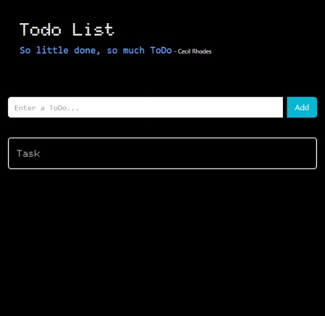
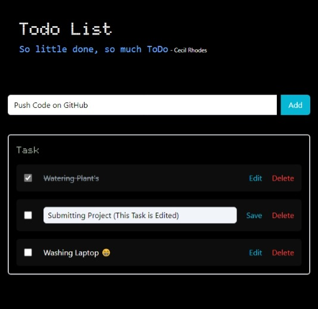

<h2>Click Here For Live Preview : &nbsp;<a href="https://sourabh-969.github.io/TODO/">ToDo</a></h2>

# To-Do List Application

A simple interactive To-Do List application built with React and styled with Tailwind CSS. It allows users to add, edit, delete, and mark tasks as completed.

<table>
<tr><h2>Home Page</h2> </tr>
<tr><h2>Add, Delete, & Mark Functionality</h2> </tr>
</table>

## Features

- Add new tasks
- Edit existing tasks
- Mark tasks as completed
- Delete tasks
- Responsive design

## Prerequisites
- node.js

## Run in our Local.machine

To install and run the To-Do List Application :

1. Clone the repository:
>>https://github.com/sourabh-969/-E-commerce-application.git

# Navigate to the project directory:
>>cd shoppyglobe

# Install dependencies:
>>npm install

# Start the development server:
>>npm run dev